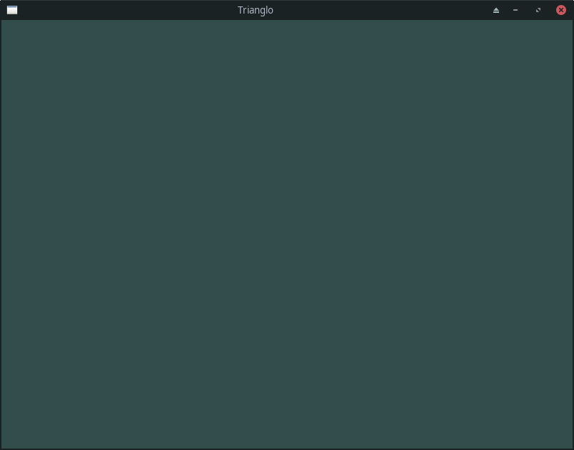

# learn-opengl
A repository where I put my learning opengl project. Also showcases it when it's ready.

# Development Log
\[25/July/2021] Started the project.

- Copied CMakeLists.txt from already made project with slight modification.
- Copied GLAD function loader from its webservice (Is now on /vendor/glad/).
- Created my first window.
- Made a VBO object containing a simple triangle vertex data. Compiled a vertex and fragment shader. Linked both shader to get a shader program.
- Wrote a simple rendering loop.
- Created and wrote this README.md

\[END] \[08:27 PM]

# Screenshots

